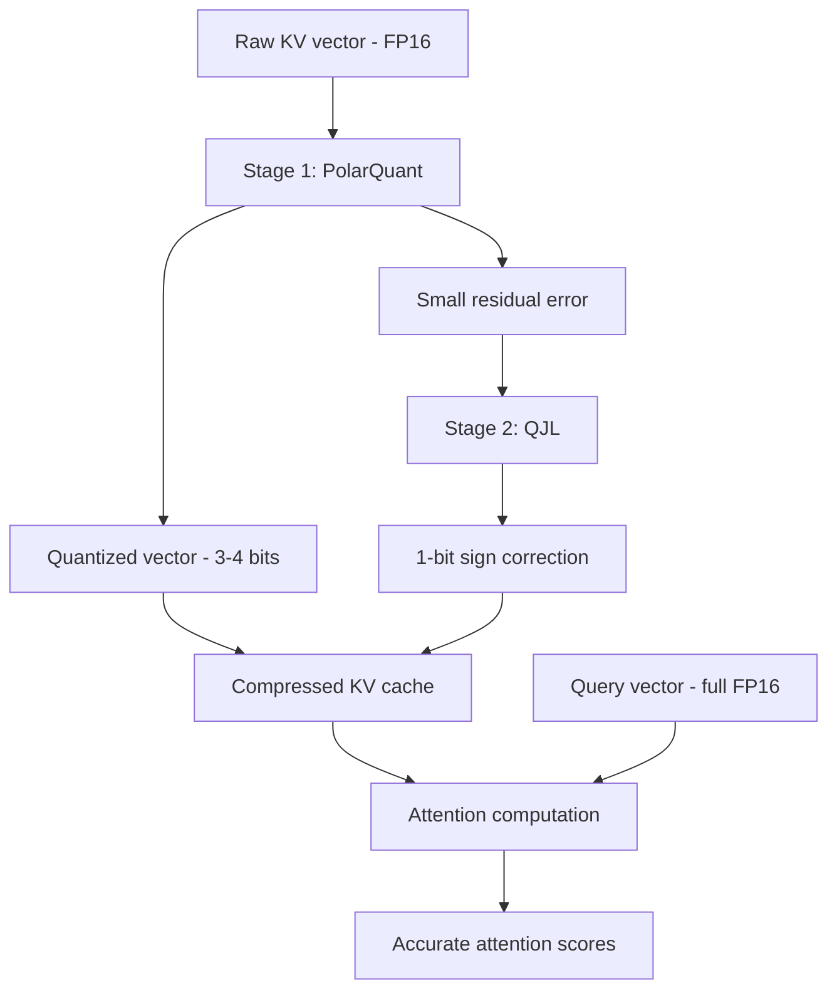
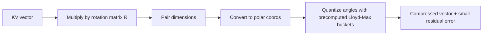
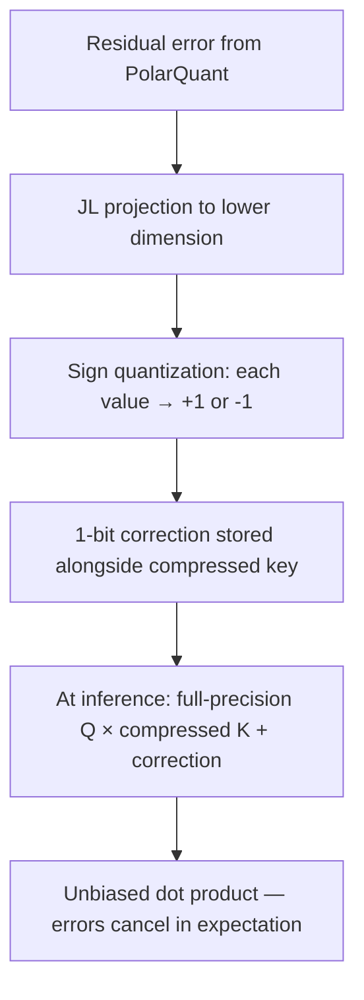

# TurboQuant — Comprehensive Technical Overview

Google Research, March 2026 — ICLR 2026

---

## 1. Background: attention and the KV cache problem

### 1.1 How attention works

Transformer models generate text by computing **attention** — a mechanism that lets each new token "look back" at all previous tokens and decide which ones matter most.

For every token in the context, the model computes three vectors:

- **Query (Q):** "what am I looking for?"
- **Key (K):** "what do I contain?"
- **Value (V):** "what information do I carry?"

Attention scores are computed as dot products between the current query and all stored keys. High dot product = high relevance. These scores are normalized via softmax, then used to weight the corresponding values. The weighted sum becomes the output for that position.

```
Attention(Q, K, V) = softmax(Q · Kᵀ / √d) · V
```

### 1.2 The KV cache

During autoregressive generation (producing one token at a time), the model would need to recompute K and V for every previous token at every step. To avoid this, transformers **cache** the key and value vectors — this is the KV cache.

The problem: KV cache size scales linearly with context length. At FP16 precision:

- 8B param model, 8K context → ~2 GB KV cache
- 8B param model, 32K context → ~8 GB KV cache
- 8B param model, 128K context → ~32 GB KV cache

At long contexts, the KV cache dominates GPU memory — often exceeding the model weights themselves. This is the bottleneck TurboQuant targets.

### 1.3 Why not just quantize model weights?

Standard quantization (INT8, INT4) compresses model **weights** — the static parameters. This helps with model size but doesn't solve the runtime memory problem. The KV cache is dynamic, grows with every token, and is the binding constraint for long-context inference. TurboQuant compresses the KV cache specifically.

---

## 2. The conventional quantization overhead problem

Vector quantization maps continuous values to discrete codes. The standard approach:

1. Divide the vector into small blocks (e.g., 32 or 64 values).
2. Compute a normalization constant (min, max, or scale) per block.
3. Quantize each value relative to that constant.

The normalization constants must be stored in high precision (FP16 or FP32), adding **1–2 extra bits per value** of overhead. At aggressive compression targets (3–4 bits), this overhead is a significant fraction of the total budget.

TurboQuant eliminates this overhead entirely.

---

## 3. TurboQuant architecture

TurboQuant is a two-stage pipeline. It requires no training data, no calibration, and no model-specific tuning. It works on any transformer architecture.



---

## 4. Stage 1: PolarQuant

### 4.1 Random orthogonal rotation

The first step is to multiply the KV vector by a random orthogonal rotation matrix **R**. This is a fixed matrix generated once and reused.

**What rotation does:** it redistributes the energy uniformly across all dimensions. Before rotation, some dimensions may carry large values while others are near zero. After rotation, all coordinates have similar magnitude.

**What rotation preserves:** dot products, distances, and angles between vectors. Since attention depends entirely on dot products (Q · K), the rotation doesn't affect model output at all. It's a lossless geometric transformation.

**Why this matters:** when all values sit in a similar range, you no longer need per-block normalization constants. The overhead drops to zero.

### 4.2 Polar coordinate mapping

After rotation, PolarQuant groups the d-dimensional vector into pairs of coordinates:

```
(x₁, x₂), (x₃, x₄), (x₅, x₆), ...
```

Each pair is converted from Cartesian to polar coordinates:

```
(x, y) → (r, θ)    where r = √(x² + y²), θ = atan2(y, x)
```

Because the rotation made coordinates follow a concentrated, predictable distribution, the angular values θ follow a known density function. This is the key insight — the distribution is **data-independent** and can be characterized mathematically in advance.

### 4.3 Optimal quantization with Lloyd-Max

Since the angular distribution is known ahead of time, PolarQuant precomputes optimal quantization buckets using the **Lloyd-Max algorithm** — a classic method for finding the set of discrete levels that minimizes mean squared error for a given distribution.

These buckets are computed once (offline) and reused for all vectors, all layers, all models. No calibration dataset needed.



### 4.4 What PolarQuant achieves

- Eliminates per-block normalization overhead (0 extra bits)
- Supports optimal scalar quantizers without data-specific tuning
- Near-lossless on its own for most benchmarks
- The remaining error is small and structured — perfect input for Stage 2

---

## 5. Stage 2: QJL (Quantized Johnson-Lindenstrauss)

### 5.1 The residual error problem

PolarQuant introduces a small quantization error. In isolation, this error is tiny. But attention computes dot products across thousands of tokens — small per-token biases can accumulate and shift attention scores, degrading output quality.

QJL eliminates this bias using just 1 extra bit per value.

### 5.2 The Johnson-Lindenstrauss transform

The JL lemma (1984) states that high-dimensional points can be projected into a much lower-dimensional space while approximately preserving all pairwise distances. QJL applies this principle to the quantization error vectors.

The projection reduces each error value to a single **sign bit**: +1 (positive) or -1 (negative). This is the most extreme quantization possible — 1 bit — but it's sufficient because QJL only needs to correct a small residual, not represent the full vector.

### 5.3 Unbiased attention estimation

The critical property: QJL's estimator is **unbiased**. This means the expected value of the estimated dot product equals the true dot product exactly.

At inference time:

- **Query (Q):** stays at full FP16 precision — never compressed
- **Key (K):** PolarQuant-compressed value + QJL sign-bit correction

The estimator pairs the high-precision query with the low-precision stored key. Because the query is exact and the sign-bit correction eliminates systematic bias, the individual rounding errors cancel out across the many multiplications in the dot product sum. This is a mathematical guarantee from the JL transform, not just an empirical observation.



### 5.4 What QJL achieves

- Zero additional memory overhead (1 sign bit is negligible)
- Eliminates quantization bias in attention scores
- Mathematical guarantee of unbiased estimation (not empirical)
- Works without any training or fine-tuning

---

## 6. Combined pipeline: how TurboQuant compresses a KV vector

Step-by-step for a single key vector during inference:

1. **Rotate:** Multiply by precomputed random orthogonal matrix R → uniform energy distribution.
2. **Pair:** Group dimensions into pairs → (x₁,x₂), (x₃,x₄), ...
3. **Polar map:** Convert each pair to polar coordinates → (r, θ).
4. **Quantize angles:** Apply precomputed Lloyd-Max buckets → 3-4 bits per value.
5. **Compute residual:** Measure the small error between original and quantized vector.
6. **JL project + sign:** Project error via JL transform, reduce to sign bits → 1 extra bit.
7. **Store:** Cache the quantized vector + sign-bit correction.

At attention time:

8. **Full-precision query** dot-producted with **compressed key** using QJL's unbiased estimator.
9. **Result:** Accurate attention scores, mathematically guaranteed unbiased.

---

## 7. Results and benchmarks

### 7.1 Benchmark suite

Evaluated on five long-context benchmarks: LongBench, Needle in a Haystack, ZeroSCROLLS, RULER, and L-Eval. Test models: Gemma and Mistral (open-source LLMs).

### 7.2 Key numbers

| Metric | Result |
|---|---|
| KV memory reduction | ≥ 6x |
| Minimum bit-width (lossless) | 3 bits |
| Attention logit speedup (4-bit, H100) | Up to 8x vs FP32 |
| Accuracy loss | Zero across all benchmarks |
| Retraining required | None |
| Calibration data required | None |

### 7.3 Practical sweet spots

- **4-bit:** Best tradeoff for most use cases. Quality indistinguishable from FP16 on 3B+ models.
- **3-bit:** More aggressive compression but quality degrades on models smaller than 8B parameters.
- **Value sensitivity:** Community experiments show value quantization is the bottleneck — 2-bit values degrade cosine similarity to ~0.94, while 4-bit maintains 0.997.

---

## 8. What TurboQuant enables

### 8.1 Longer contexts on existing hardware

If a 16 GB GPU hits OOM at 16K context, TurboQuant can push that boundary to 64K+ without new hardware. At 128K+ contexts, savings reach tens of gigabytes.

### 8.2 Edge and mobile inference

3-bit KV cache compression makes 32K+ context feasible on phones and embedded devices with software-only implementations.

### 8.3 Faster vector search

For approximate nearest neighbor (ANN) systems like FAISS, TurboQuant improves recall while keeping indexing overhead near zero. Real-time indexing and sub-millisecond search become more practical.

### 8.4 Cost reduction at scale

Multi-tenant inference serving (multiple users sharing one GPU) benefits directly — less KV memory per user means more concurrent sessions per GPU.

---

## 9. What TurboQuant does NOT do

- Does not compress model weights (use standard INT8/INT4 quantization for that)
- Does not reduce training memory — only targets inference
- Does not solve RAM shortages caused by training workloads
- Not a replacement for weight quantization — complementary technique

Combining TurboQuant (KV cache) with INT4 weight quantization maximizes total system compression.

---

## 10. Implementation status (as of April 2026)

- **Paper:** Published March 24, 2026. Presented at ICLR 2026.
- **Official code:** No open-source release yet. Google expects Q2 2026.
- **Community implementations:** Several unofficial ports exist (llama.cpp, HuggingFace). An open feature request on vLLM to integrate TurboQuant as a native KV cache option is active.
- **Hardware:** H100 and A100 are ideal targets. 4-bit mode is where the paper reports peak speedups.

### Practical deployment tips (from community experiments)

- Pre-generate and reuse rotation matrices instead of rebuilding online.
- One FP16 scalar overhead is small enough to be negligible.
- Test carefully on models under 3B params — quantization noise can cause repetitive output.
- Use TurboQuant for KV cache + INT4 for weights for maximum compression.
